# Wealth Tracker — Product Requirements

Status: Draft for implementation planning
Date: 28 September 2026

## 1. Purpose

Build a web app for recording and understanding personal net worth, replacing the existing wealth-tracking spreadsheet with a focused application experience.

The core workflow is deliberate: the user updates their balances, fetches their Trading 212 account value, and saves a monthly snapshot. The app presents those snapshots through a dashboard and historical charts. A separate budget page supports monthly planning.

This document captures the agreed product scope and technical stack. Optional enhancements and implementation details are distinguished from launch requirements.

## 2. Product principles

- Make recording a snapshot quick and understandable on desktop and mobile.
- Support generic, user-defined cash accounts. No bank names, account names, account groups, or provider-specific cash behaviour are built into the product.
- Accept positive and negative cash balances. Debt is represented by a negative balance in the same account list.
- Use Trading 212 as the only investment integration for current snapshots. Manual historical totals are allowed only in the historical entry flow; no manual holdings or transaction entry is required.
- Treat saved snapshots as historical records. Live prices and later balance updates must not silently change them.
- Track net worth and changes in balances. Do not describe those changes as investment returns or infer their causes.
- Keep budgeting separate from recording actual balances.

## 3. Intended use

Users sign in with Google and access their own private financial data. Accounts, connections, budgets, and snapshots are scoped to the authenticated user. The user manually records snapshots for calendar months identified by `YYYY-MM`. Each user has at most one active snapshot per month. Recording is optional; missing months remain missing and there is no automatic recording.

The existing spreadsheet is a reference for useful outputs and a potential source of historical data. Its tabs, fixed row limits, formulas, scripts, and provider names are not the application's structure.

## 4. Scope

### Included

- Generic Cash and Debt accounts with user-defined names and signed balances; debts are entered as negative amounts.
- Manually tracked investment account balances, included in net worth without holdings or cash-movement entry.
- Manual pension balances, identified separately from accessible wealth.
- Read-only Trading 212 connections supporting both Invest and Stocks ISA accounts.
- A guided workflow to record dated net-worth snapshots.
- A dashboard with historical charts and asset breakdowns.
- A monthly budget with income, expenses, annual-expense provisions, per-account funding instructions, and the spreadsheet's dynamic cash/investment allocation rules.
- Emergency-fund targets, savings goals and projections, inferred spending, and historical savings rates.
- Snapshot history, notes, and deliberate corrections.
- A manual historical entry flow for adding past months.
- Account renaming and archiving without losing historical records.

### Excluded from the initial release

- Account-group entities, bank-specific features, and bank integrations. Table grouping is a display preference, not an account hierarchy.
- Automated integrations with other investment providers and manually entered holdings/transactions. Manual investment account totals are supported.
- Trading, order placement, or portfolio rebalancing.
- User-facing transaction ledgers, automatic spending categorisation, and bank reconciliation. Internal read-only Trading 212 history access for savings calculations is included; no transaction-entry page is added.
- Investment-performance reporting, XIRR, and capital-gains calculations. Contribution inputs needed for savings/spending inference use read-only Trading 212 history and confirmed manual period inputs.
- Separate debt-management or repayment-planning features.
- Property ownership/mortgage tracking, FIRE projections, suggested next investment category, purchase timing, and reminder emails. Cash/investment budget allocation and savings-goal projections are included.
- Automatic daily snapshots, real-time streaming, and mandatory monthly closing.
- Multi-currency conversion. All entered and recorded monetary totals are in GBP.
- Bulk spreadsheet or file import.

## 5. Application structure

### UI direction

Use a clean finance-app design with a dark theme. Use Material UI (MUI) as the component library, customised through a shared theme to preserve the approved visual direction. Use Recharts for charts. Keep UI copy limited to meaningful labels, values, actions and necessary explanations; omit decorative captions and filler text. The [Material UI overview mockup](mockups/overview-mui.html) is the approved visual direction for implementation. The [original mockup](mockups/overview.html) is retained for comparison. Sample data and preview-only interactions do not define additional product behaviour. Use the `frontend-design` skill during frontend design and implementation. Navigation destinations are Overview, Accounts, Budget, and History, with a desktop side navigation bar as the preferred direction.

Preferred recording interaction for layout review: a Record snapshot button in navigation opens a modal rather than a dedicated page. This retains the one-action fetch-and-save operation, with an explicit replacement warning when the month already has a snapshot. Exact modal layout and mobile navigation treatment remain to be reviewed.

Prefill all manual account inputs from persisted working balances, falling back to previous recorded balances when no working balance exists. Show previous recorded values with their month for comparison. Support multiple user-named, manually maintained pension accounts. No account groups or hardcoded providers are introduced.

### Overview

The default dashboard displays the latest saved snapshot, not a mixture of saved balances and live investment values.

It includes:

- Total net worth and the snapshot's month (`YYYY-MM`).
- Absolute change since the preceding recorded month, with both months visible; gaps must not be labelled as a single month’s change.
- A net-worth history chart with a selectable date range.
- A breakdown of net cash (Cash and Debt), investments (manual and automated), and pensions.
- Wealth excluding pension, clearly labelled as such.
- Changes by component or account when comparing snapshots.
- A prominent **Record net worth** action.

Use charts that can represent negative balances. Missing periods must not appear as zero or as invented snapshots. With no snapshots, provide a clear first-recording action. With one snapshot, display its value without a fabricated change or trend.

### Accounts

Provide a “Manually tracked accounts” TanStack Table with MUI cell editors for Cash, Debt, Investment and Pension accounts. Each account has a user-defined name and an autosaved signed working balance, independent of monthly snapshots. Names such as bank names or pots are ordinary user data.

Allow users to add, rename, and archive accounts. An account used in a saved snapshot must retain its historical records when archived. Archiving alone must not revise saved net worth.

Manual rows can be grouped by type or archive status. Cash and Debt can be reclassified inline without changing balances or prior snapshots; other asset-type changes require a new account. Net cash includes both signed Cash and Debt balances. Manual investments join the investment total and asset filters. Inferred savings/spending are unavailable when either reading in an interval includes a manual investment, because no movement history is collected.

The “Automated tracking accounts” table contains Trading 212 connections with an explicit Provider column and holdings access. Trading 212 remains the only automated integration.

### Budget

Provide one editable current monthly plan containing take-home income, named expense items, total planned expenses, and remaining income. Budget version history is excluded initially. Retain period-specific income and calculation inputs needed to explain historical savings metrics; later budget edits must not silently rewrite those inputs. Section 15 specifies the approved budgeting/savings parity requirements and the remaining adaptation questions.

Users can add, inline edit, drag reorder, and remove expense and planned saving items in TanStack tables. Budget settings and valid edits autosave; no Save budget action is required. Monthly planning, salary-frequency conversion, and annual-expense provisions are required. Associate budget allocations with user-defined destination accounts and show their per-pay-period funding totals. Account associations do not introduce account groups or execute transfers.

Calculations:

```text
Remaining monthly income = monthly take-home income − planned monthly expenses
Planned savings rate = remaining monthly income ÷ monthly take-home income
```

For zero income, show the savings rate as unavailable. A deficit must remain visible as a negative amount. Distinguish planned spending and savings from inferred historical spending and savings. Inferred values are estimates from recorded balances and confirmed period inputs, not bank-transaction totals. Editing the budget must not change balances or saved snapshots. Show the dynamic allocation, emergency target, account funding plan, goals, and projections described in section 15.

### History

List one active snapshot per `YYYY-MM`, ordered by month. Live recordings and manual historical entries share this monthly identity. Each entry opens its available balance breakdown, notes, revision history, and investment valuation timestamps where applicable. UTC creation/update timestamps are audit metadata, localised only for display; they do not determine the represented month.

Allow comparison with the preceding snapshot and inline autosaved correction of recorded manual balances, period inputs and notes. Manual monthly totals are editable directly in the history table, including imported current-month history. Recorded months expose individual manual balances in Details; their aggregate totals are derived. Each successful correction creates an immutable revision without a per-cell confirmation dialog. Fetched Trading 212 valuations remain immutable within each revision; deliberately replacing a current month can fetch new values into a new revision. Manually entered historical monthly totals remain editable. Preserve the previous revision so corrections are inspectable. A correction updates affected charts and comparisons; it must not silently replace values using today's Trading 212 data. Reject an edit based on an outdated record and ask the user to reload, rather than overwrite another tab's saved change. The write enforces this check atomically using the approved snapshot/revision/operation transaction described in [the persistence design](persistence-and-auth-design.md).

Accounts, History and Budget use TanStack Table with MUI styling and dnd-kit drag handles. Grouping, sorting, column order and manual row order are saved per user/table in DynamoDB and sync across devices. Accounts and budget rows support manual reordering with sorting/grouping cleared; History remains ordered by month/value, without arbitrary row ordering. Columns are draggable on all three pages. History can group by year or source; budget items by frequency or destination. Groups start expanded, including when changing the grouping or reopening a saved view. Group headers total account balances and investment values. Budget group totals retain their annual/monthly unit when homogeneous and use a labelled monthly equivalent for mixed periods. Missing balances do not count as zero. Historical net-worth readings are not added across months. UI text uses no bullet-symbol separators; drag handles use line icons.

Text/money cells save on blur or Enter; Escape cancels a pending cell edit. Selects save on selection. Budget changes are debounced and serialised. Invalid inputs remain visible with an error, and failed/conflicting saves are never silently treated as saved. Reload is required after a conflicting edit. A cell retains the record version from the start of editing, even if background data refreshes.

The Record snapshot action stays explicit and continues to require confirmation before replacing a month. Working balances do not update the dashboard, historical records or the budget's recorded-balance allocation basis.

## 6. Record net worth workflow

1. **Prepare balances for the current month (`YYYY-MM`):** Show active cash accounts prefilled from working balances (or previous recorded balances when no working value exists), alongside the last recorded values. Accept negative values for debts.
2. **Update pension and period inputs:** Enter or confirm manual pension balances. For savings/spending inference, confirm or edit period income prefilled from the budget and enter qualifying pension contributions separately. Associate these inputs with the selected month. Use the actual UTC interval between consecutive captured balance readings; pensions are excluded from savings rate. The one pension input is contributions paid from cash, deducted from inferred spending. Allow an optional note.
3. **Record snapshot:** If this month already has a snapshot, warn that saving will replace it and require explicit confirmation; cancelling leaves it unchanged. Otherwise, one user action sends the entered balances and month to the backend. The backend fetches every connected Trading 212 account, calculates totals, and saves the complete snapshot if successful. Read-only provider-history data also feeds the approved savings calculations; history refresh is resumable and rate-limited. A snapshot can save while history is incomplete, with inferred metrics unavailable until coverage is complete. Users without a connection can save cash and pension balances without a provider fetch.
4. **Show result:** Display the saved month and values. Keep per-account valuation timestamps and server-assigned UTC creation/update timestamps as supporting metadata, localised on the frontend.

There is no separate confirmation after fetching investment values and no persisted draft. Unsaved entries exist only in the current form and remain available during failed-request retries. Closing or reloading the page discards unsaved entries. The server obtains investment values during the recording request; it does not trust client-supplied investment valuations or reuse a previous fetch as a fallback.

A snapshot is identified by its owner and validated calendar month (`YYYY-MM`), not an ISO timestamp. Saving again for the same month replaces its active snapshot only after an explicit warning and confirmation, preserving the previous revision. Both recording flows use the same monthly uniqueness rule. Enforce the expected revision atomically: if another save creates or changes that month after the user viewed it, reject the stale save and require reload/reconfirmation. Retries or repeated clicks for the same operation return the saved result without creating another snapshot or revision. UTC audit timestamps do not shift a snapshot into another month.

### Failure handling

- If any connected Trading 212 account cannot be fetched for the current recording flow, block saving, show a clear failure, and retain the user's entered balances for retry.
- Never substitute zero for missing investment data.
- Previous valuations can remain visible with their timestamps, but cannot substitute for a successful fetch in the current recording flow. There is no stale-value override.
- Do not save a partial investment total when one connected account succeeds and another fails.
- The separate manual historical entry flow does not fetch today's investment data and is not blocked by a current provider outage.
- Saving must either persist the complete snapshot or fail without a partial historical entry.

## 7. Calculation rules

```text
Net cash = sum of signed Cash and Debt account balances
Investment account value = manual Investment balances + connected Trading 212 account totals, including their cash
Pension value = sum of manual pension balances
Net worth = net cash + investment account value + pension value
Wealth excluding pension = net cash + investment account value
Change = selected snapshot value − preceding snapshot value
```

### Avoiding double counting

Trading 212's total account value is included once. Its holdings and uninvested cash can be displayed as a breakdown, but must not be added again to that total or entered again as manual cash accounts.

Debt is already subtracted through negative cash balances. No additional liability subtraction is applied to those accounts.

Moving money between a cash account and Trading 212 does not change net worth once both recorded balances reflect the transfer. No transaction import or contribution analysis is required to establish that net-worth total. The separately approved inferred savings/spending features do need period income and money-movement inputs; do not conflate these calculations. Temporarily mismatched balances during a pending transfer remain a balance-review concern.

Use decimal-safe monetary storage and calculation. Format GBP amounts to two decimal places; avoid binary floating-point rounding in totals. Percentage comparisons, if offered, should be unavailable when the baseline is zero or negative rather than display misleading results.

## 8. Trading 212 integration

The user connects through Trading 212 API credentials with read-only permissions. Credentials are stored securely on the server and must not be exposed in browser responses or logs. All provider requests originate from the backend.

Retrieve the account identity, reporting currency, total value, and current positions needed for review and display. Account totals are authoritative for net worth; holdings are supporting detail. Verify exact response fields and currency semantics against the provider documentation during implementation. Require GBP account totals for this release; do not relabel non-GBP amounts as GBP. Instruments may trade in other currencies, but their contribution to net worth must use the provider's GBP valuation.

The earlier API review identified Invest and Stocks ISA as supported account types. Do not assume pension or Cash ISA API coverage. Those balances remain manual where applicable.

Respect provider rate limits, cache the last successful response, display sync timestamps, and provide reconnect/disconnect behaviour. Disconnecting must preserve historical snapshots. Do not request trading permissions or call trading endpoints.

Support separate Invest and Stocks ISA connections for the same user, with either or both connected. Prevent duplicate linking of the same provider account. Include each connected account exactly once in the total.

Reference: [Trading 212 API documentation](https://docs.trading212.com/api/accounts).

## 9. Snapshot history and manual historical entry

A snapshot contains its `YYYY-MM` month, source (live recording or manual historical entry), revision, UTC creation/update audit timestamps, component balances and optional notes. Live recordings also retain account identities and display names at recording and investment valuation timestamps. Preserve enough information to reproduce its total without contacting Trading 212.

Historical values must remain stable after an account is renamed, archived, disconnected, or repriced. Corrections are explicit revisions.

Provide an **Add past month** flow. The user selects a historical month and enters GBP totals for net cash (including negative balances), investments, and pension, plus an optional note. Calculate the historical net-worth total from those components. This permits entering existing spreadsheet history one month at a time without a bulk importer or a manual investment portfolio feature.

Store the selected month as the same `YYYY-MM` identity used by live recordings, separately from UTC audit timestamps, and label the source as manual historical entry. Do not invent an exact historical recording time or per-account detail that the user did not supply. The frontend must not shift the selected month when localising timestamps.

Do not fetch or use today's Trading 212 valuation for a historical month. Historical totals are manually supplied and remain separate from current account state. Adding a historical entry must not overwrite a more recent current snapshot or change its balances.

Charts use the single active snapshot for each `YYYY-MM`. There is no last-record selection or fallback priority between live and manual sources. Show the source and available detail. If the chosen historical month already exists, warn and require explicit confirmation to replace it under the same concurrency rule as current recording. Preserve prior revisions for inspection, but do not plot them as additional monthly points.

## 10. Committed technical direction

Use a TypeScript React frontend, tRPC API running on AWS Lambda, and DynamoDB accessed through ElectroDB. Host on AWS and manage deployed infrastructure with Terraform. Implement Google sign-in directly in the backend, allowing any Google account to sign in. Use an opaque token in a Secure, HttpOnly cookie, with its hash and server-side session record stored in DynamoDB; sessions expire after 45 days without activity, extend on activity without an absolute maximum lifetime, and are immediately revoked on logout. Serve React through S3 and CloudFront; API Gateway routes backend requests to one Lambda. Use a single DynamoDB table with ElectroDB entities, and encrypt Trading 212 credentials using AWS KMS before storing them in that table.

Suggested responsibilities:

- **Frontend:** Dashboard, account forms, budget planning, snapshot recording, and history.
- **Backend:** Authentication, input validation, Trading 212 access, snapshot calculations, and persistence.
- **Storage:** Account definitions and working balances, budget settings, table preferences, connection metadata, session records, snapshots, and correction revisions. No persisted snapshot drafts.
- **Secrets:** Encrypted storage for Trading 212 credentials with server-only access.

Design DynamoDB keys and indexes around listing a user's accounts, retrieving their budget, listing snapshots by date, reading a snapshot, and retrieving its revisions. Do not reproduce spreadsheet rows and cell references as the database model.

No scheduled investment sync is necessary for the initial workflow. Fetching during snapshot preparation and on explicit refresh is sufficient.

### Local development

Provide a documented local setup with Docker Compose for DynamoDB Local and repeatable table initialisation. Run the React frontend and tRPC backend locally using the same business logic, validation, and ElectroDB models as production, with a configurable database endpoint.

Run the frontend and API development servers on the host for fast reloads, with only DynamoDB Local in Compose. Core development should not require deploying Lambda or using a cloud DynamoDB table.

Supply example environment configuration without secrets and document Google sign-in localhost configuration. Offer clearly labelled development fixtures for Trading 212 so the UI and snapshot flow can be exercised without real credentials; production must never fall back to those fixtures. Terraform owns cloud infrastructure rather than requiring a full AWS emulator locally.

## 11. Quality requirements

- Require Google sign-in and enforce user ownership on every private-data operation. Derive ownership from the authenticated server session, not a client-supplied user identifier.
- Keep credentials and financial records out of application logs and analytics payloads.
- Validate monetary amounts and required fields on the server as well as the client.
- Support keyboard navigation, labelled inputs, readable charts, and mobile balance entry.
- Show loading, empty, error, and stale-data states explicitly.
- Prevent duplicate snapshots from retries or repeated clicks.
- Preserve historical records through account lifecycle changes.

## 12. Acceptance criteria

1. A user can create arbitrarily named cash accounts without choosing a bank or a group.
2. Positive and negative balances contribute correctly to the total. For example, £1,000 cash, −£200 debt, £3,000 Trading 212 total value, and £5,000 pension produce £8,800 net worth.
3. Moving £500 from cash to Trading 212 leaves net worth unchanged when both balances reflect the transfer.
4. Trading 212 cash is included exactly once, irrespective of whether holdings are displayed individually.
5. One Record snapshot action fetches connected investments and saves a complete snapshot on success, without a post-fetch confirmation or investment transaction entry. An existing month requires replacement confirmation before saving.
6. A failed fetch for any connected Trading 212 account blocks current snapshot recording. Neither zero, stale values, nor partial account totals can bypass the failure.
7. Refreshing prices, editing the budget, or renaming an account does not alter saved snapshots.
8. History and charts display the same saved totals and show one point per saved month, with missing months left missing.
9. Correcting a snapshot preserves its previous revision and updates the displayed comparisons.
10. Planned budget results and inferred historical spending/savings are distinctly labelled. Missing inference inputs cannot be silently treated as zero.
11. The initial product contains no account grouping or hardcoded cash-provider behaviour.
12. A user can connect both Invest and Stocks ISA accounts; each account total is included exactly once.
13. Each user has at most one active snapshot per `YYYY-MM`. A repeat save warns before replacing the month and preserves its previous revision. Stale concurrent saves are rejected, and retries create neither duplicate snapshots nor extra revisions. UTC timestamps are audit metadata only.
14. A user can manually add a historical month using cash, investment, and pension totals without fetching Trading 212 or using bulk import. Its represented month and creation timestamp remain distinct.
15. Google-authenticated users cannot read or modify another user's data.
16. Developers can run the frontend, API, and local database without deploying AWS infrastructure. Terraform defines the deployed infrastructure.
17. Sessions extend on activity, expire after 45 days without activity with no absolute maximum, and are immediately invalidated by logout. Expired or revoked sessions cannot be renewed.
18. Budget funding instructions use generic destination accounts, annual costs produce monthly provisions, and the dynamic allocation and projection calculations are verified against documented spreadsheet examples.
19. Savings inference uses read-only provider history and confirmed period inputs; trading within an account and transfers between connected investment accounts do not create new savings. Brokerage cash remains classified as investments for planning.

## 13. Decision record

- **Repository and local development:** pnpm workspaces (`apps/web`, `apps/api`, shared packages), workspace scripts without Nx/Turborepo, Vite, Vitest, Oxlint and Oxfmt. Deployments are a separate pass. The local baseline table has string `pk`/`sk` keys, on-demand capacity and `expiresAt` TTL; entity keys/indexes still require review. See [implementation status](implementation-status.md).
- **UI:** Approved Material UI overview direction, customised dark theme, Recharts, and concise functional copy.
- **Currency:** GBP only.
- **Investment connections:** Support both Trading 212 Invest and Stocks ISA.
- **Authentication:** Direct Google sign-in, open to any Google account, with opaque Secure/HttpOnly cookie sessions backed by hashed tokens in DynamoDB and private user-scoped data. A public launch or marketing/signup programme is not part of this PRD.
- **Session expiry:** Sliding 45 days without activity, extended on activity with no maximum lifetime; logout immediately revokes the current session.
- **Recording action:** Fetch and save in one action, with explicit confirmation before replacing an existing month. Unsaved balances remain only in the current form; no persisted drafts.
- **KMS allocation:** One customer-managed encryption key per environment, shared across users; separately encrypted credentials.
- **Snapshot identity:** One active snapshot per user and `YYYY-MM`; a confirmed save replaces that month and retains the previous revision. This supersedes the earlier timestamp-based, multiple-recordings model. UTC capture timestamps also define the savings interval; they do not determine the snapshot identity.
- **Budgeting and savings:** Retain account funding plans, annual provisions, emergency targets, the spreadsheet's dynamic allocation rules, savings goals/projections, inferred spending and savings rates. Read necessary Trading 212 history automatically and confirm period income/pension contributions. Full brokerage value remains investments.
- **Provider failure:** Block current recording if any connected Trading 212 account cannot be fetched; no stale-value override.
- **Historical data:** Manual entry of past months; no bulk import for the initial release.
- **Stack:** React, TypeScript, tRPC, Lambda, DynamoDB, ElectroDB, AWS hosting, and Terraform. Provide a local development setup using Docker Compose and DynamoDB Local.

The core remains generic signed Cash/Debt balances, manual Investment/Pension balances, automated Trading 212 investments, a budget, and recorded net-worth history. Architecture choices below require confirmation before being treated as decisions.

## 14. Architecture design — confirmed foundation

Status: Core deployment, session format, recording interaction, and KMS allocation confirmed. Deployment routing, monthly chart selection, and rejection of conflicting edits are confirmed. The 45-day sliding session policy is confirmed; the physical schema and OAuth flow are approved in [the persistence design](persistence-and-auth-design.md).

The diagrams show one backend Lambda and one DynamoDB table, with logical responsibilities inside those boundaries. Pending decisions are labelled explicitly. Current recording uses one fetch-and-save action after any required month-replacement confirmation; no server-side review state or draft entity is required.

PlantUML source is embedded alongside rendered diagrams. Syntax reference: [PlantUML component diagrams](https://plantuml.com/component-diagram) and [sequence diagrams](https://plantuml.com/sequence-diagram).

### 14.1 System boundaries

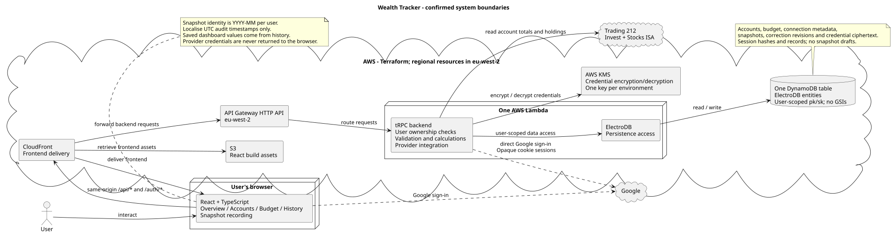

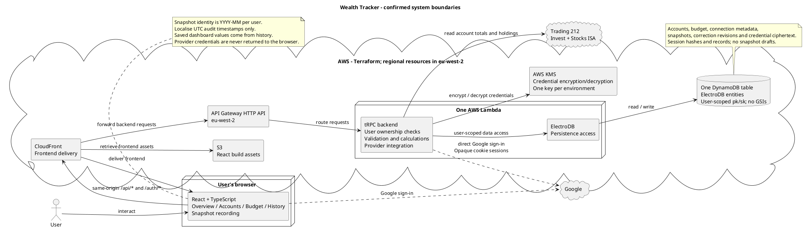

The API enforces the authenticated user's ownership for every operation. Google sign-in is implemented directly in the backend and is open to any Google account. Cognito is not part of this design. The browser holds an opaque session token in a Secure, HttpOnly cookie. DynamoDB stores its hash and the session record. The backend validates that session for protected requests. JWT access/refresh tokens are not used. Activity extends the session expiry to 45 days after that activity, with no absolute maximum lifetime. Logout immediately revokes the session.

Trading 212 is called only by the backend. The frontend can submit credentials when connecting an account, but subsequent API responses must not expose them. Credential ciphertext is stored in the single DynamoDB table. KMS performs application-level encryption/decryption; decrypted credentials are used only by the backend for provider requests. This is separate from DynamoDB storage encryption. One customer-managed KMS key per deployed environment is shared across users, with each credential encrypted separately. Local AES-GCM ciphertext is bound to the user/account identity. The deployed KMS adapter, key policy and rotation belong to the separate deployment pass.

### 14.2 Current snapshot recording

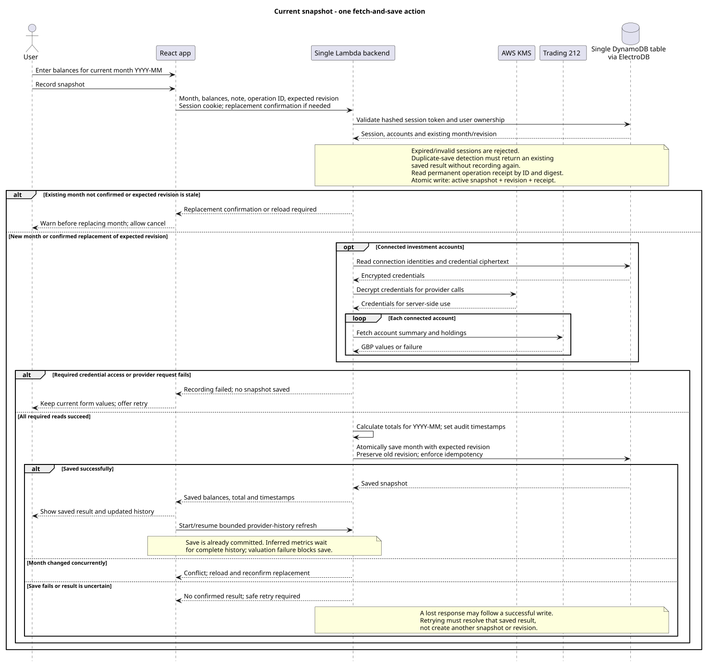

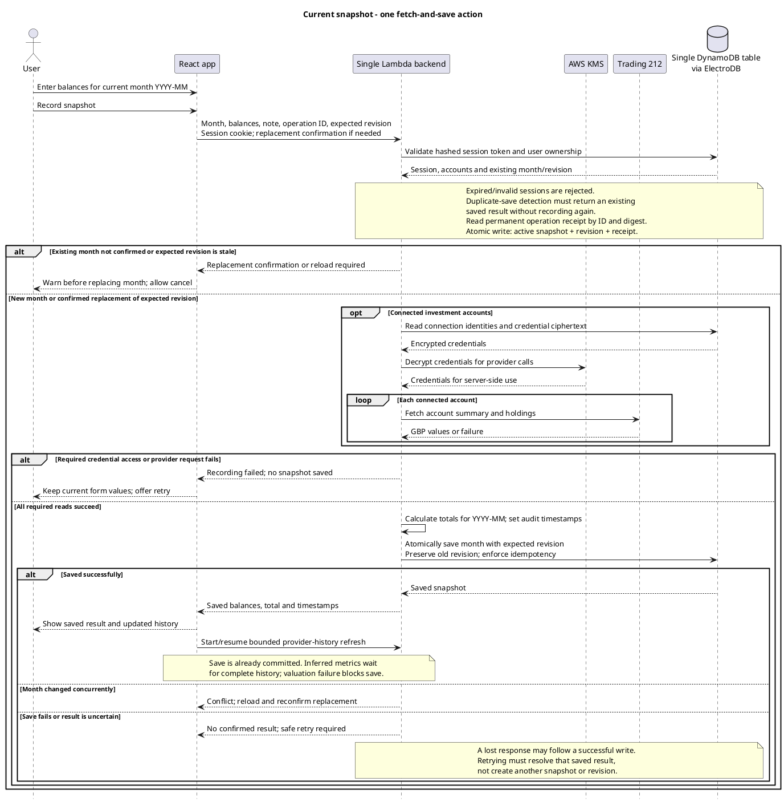

The backend owns provider fetching, calculations, and the complete write. An existing month requires a replacement warning and confirmation, not a fetched-value review step. No separate pre-save review valuation, valuation expiry window, or persisted draft is needed. A failed response is not proof that a database write failed; duplicate prevention must cover retries after a lost response. An atomic transaction writes the active monthly snapshot, immutable revision and permanent operation receipt with its input digest. Conditional revision checks reject conflicts; a retry returns its original recorded result.

### 14.3 Historical entry and recorded-history reads

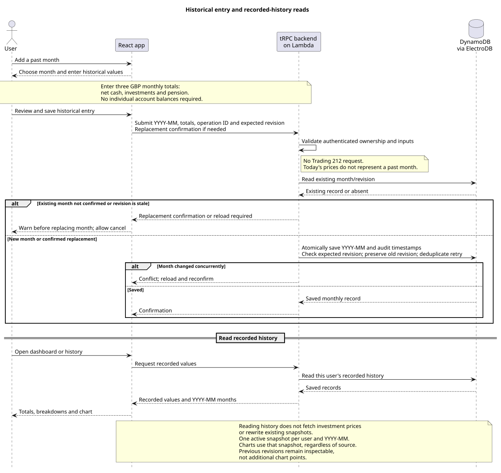

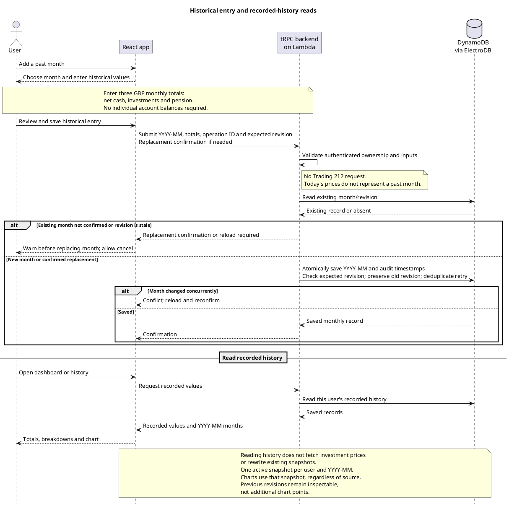

### 14.4 Responsibilities and persistence access patterns

These are logical requirements, not a table-per-row or service-per-row design.

| Responsibility         | Reads                                                       | Writes                                           | External dependency                       |
| ---------------------- | ----------------------------------------------------------- | ------------------------------------------------ | ----------------------------------------- |
| Accounts               | User's account definitions and previous recorded balances   | Account names and archive state                  | None                                      |
| Budget                 | User's monthly plan                                         | Income and expense items                         | None                                      |
| Investment connections | Connection metadata and last successful provider data       | Connection metadata and encrypted credentials    | Trading 212                               |
| Current recording      | Accounts, connected provider valuations, preceding snapshot | Monthly snapshot and preserved previous revision | Trading 212 if connected                  |
| Historical entry       | Relevant existing history                                   | Manually supplied historical record              | None                                      |
| Corrections            | Selected snapshot and its revisions                         | Explicit corrected revision                      | No automatic replacement with live prices |
| Dashboard/history      | Saved snapshots and historical records                      | None                                             | None                                      |

Every access is scoped to the authenticated user. One table with multiple ElectroDB entities is confirmed. The approved implementation uses string pk/sk keys, ElectroDB entity prefixes, user-scoped records and no secondary indexes; snapshot/revision/operation writes share one transaction. See [the physical persistence design](persistence-and-auth-design.md). Saved records retain their values independently of current account names and current provider prices.

### 14.5 Confirmed deployment and local topology

- **Production:** Regional resources run in AWS London (eu-west-2). React assets in S3 are delivered through CloudFront. The browser uses one app origin; CloudFront forwards `/api/*` and `/auth/*` to API Gateway HTTP API, which routes to one Lambda containing the backend; ElectroDB uses one DynamoDB table; KMS encrypts provider credentials stored in that table; Terraform manages deployed infrastructure.
- **Authentication:** Direct backend integration with Google; any Google account may sign in, with private user-scoped application data.
- **Development:** React and the API run on the host. DynamoDB Local runs in Docker Compose. The local backend shares application logic and ElectroDB entities with production.
- **Historical entry:** Three monthly totals: net cash, investments, and pension.

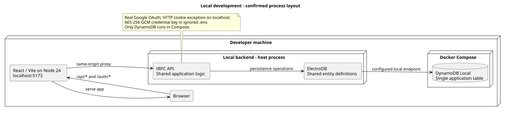

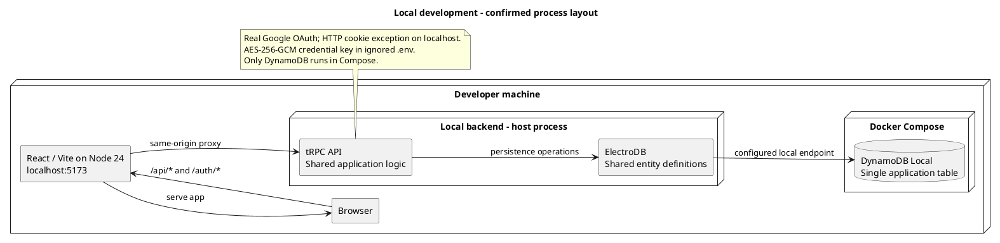

### 14.6 KMS cost and key allocation

AWS lists a customer-managed KMS key at **USD $1/month**, prorated hourly. Its symmetric-request example uses **$0.03 per 10,000 requests**, with **20,000 eligible requests/month free across regions**. The first and second rotations each add $1/month to key storage charges; further rotations do not add further storage charges. Source: [AWS KMS pricing](https://aws.amazon.com/kms/pricing/), checked 28 September 2026.

For illustration, one unrotated key and 1,000 eligible encryption/decryption requests per month would cost approximately **$1/month for KMS** if the account's free allowance is available. This excludes DynamoDB, Lambda, API Gateway, frontend hosting, taxes, and other services. Final regional pricing and account-wide allowance usage must be checked when estimating deployment costs.

**Confirmed:** one customer-managed key per deployed environment, shared across users, with separately encrypted credentials. This avoids allocating a billable KMS key per user. The number of environments and rotation policy are not selected here.

### 14.7 Session lifecycle

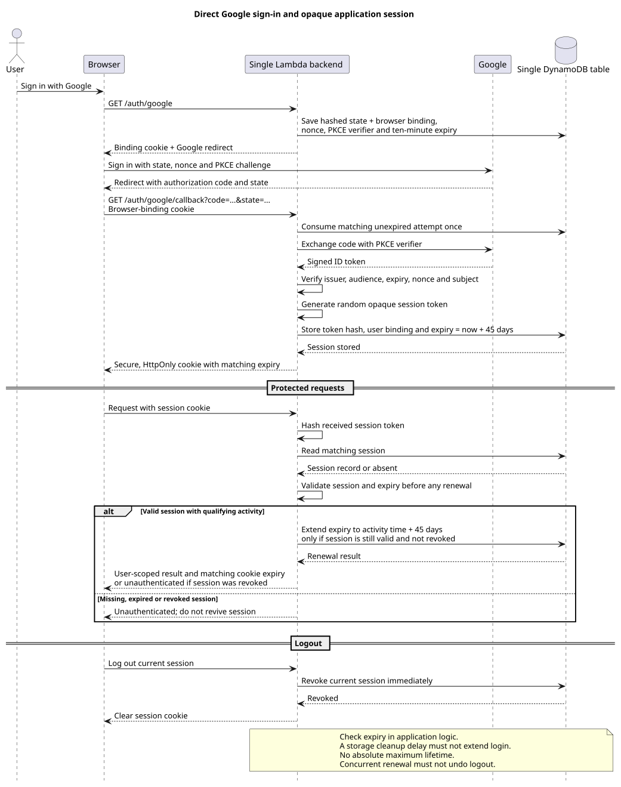

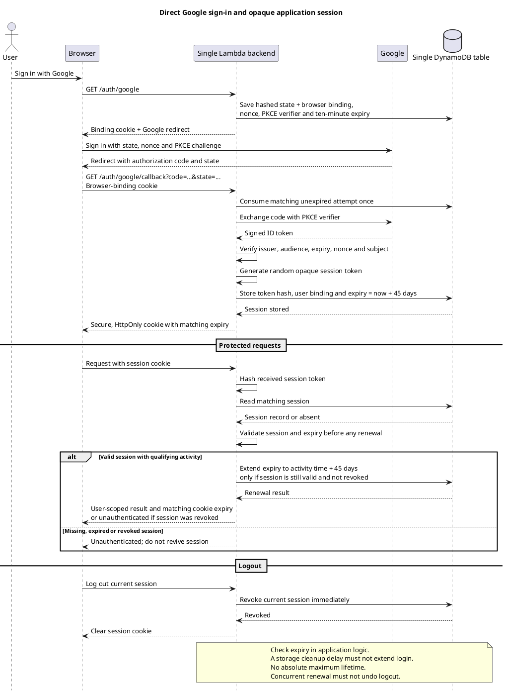

The raw application session token is not stored in DynamoDB or exposed to frontend JavaScript. The session record binds the token hash to the authenticated user. Google identity verification and the application session are separate responsibilities; Google tokens are not used as application access tokens.

Reference: [OWASP session management](https://cheatsheetseries.owasp.org/cheatsheets/Session_Management_Cheat_Sheet.html). The implemented design uses SameSite=Lax, state/nonce/PKCE with browser binding, and POST /auth/logout with an Origin check. The expiry policy below is explicitly user-selected; it is not presented as the policy recommended by OWASP.

### 14.8 Remaining decisions and next design review

Confirmed in the latest design review:

- **Deployment routing:** AWS London (eu-west-2), API Gateway HTTP API, and one app origin with CloudFront forwarding `/api/*` and `/auth/*` to the backend. The actual domain is not selected.
- **Monthly snapshots and charts:** One active record per user and `YYYY-MM`, shared by live and manual flows. Warn and confirm before replacing an existing month; retain revisions separately. Charts use the active monthly records.
- **Conflicting edits:** Reject a save based on an out-of-date record and ask the user to reload instead of silently overwriting a newer change.

**Confirmed session policy:** expire after 45 days without activity. Each qualifying activity extends expiry to 45 days after that activity. There is no absolute maximum lifetime. Logout immediately revokes the current session and clears its cookie.

Enforce expiry on the server before renewal; expired or revoked sessions cannot be revived. Keep browser cookie expiry aligned with server-side expiry. Renewal must not recreate a session deleted or revoked by a concurrent logout. DynamoDB expiry cleanup is not the authentication enforcement mechanism.

Foreground authenticated requests made while using the app count as activity; background history polling does not. Renewal conditionally extends a valid session to request time plus 45 days and cannot recreate a session deleted by logout. Google login uses authorization code, PKCE, state, nonce and a one-time browser-bound attempt. Local HTTP is the approved Secure-cookie exception; local provider credentials use AES-256-GCM with an ignored environment key.

The [persistence and authentication design](persistence-and-auth-design.md) is approved and implemented locally. Regional deployment, domain configuration and KMS implementation remain in the separately requested deployment pass. Calculation decisions are recorded in [the financial rules](calculation-rules.md).

## 15. Budgeting and savings — approved spreadsheet parity

Status: The retained features and adaptations below are approved and implemented locally. [Calculation rules](calculation-rules.md) specify the final formulas and unavailable-data behaviour; the source inventory below records the original spreadsheet logic.

### 15.1 Included behaviour

- Account funding instructions, using generic destination accounts attached to budget allocations.
- Annual expenses converted into monthly provisions and included once in the plan.
- Salary-frequency conversion and per-pay-period funding amounts.
- Emergency-fund target and priority over investment allocation.
- Dynamic distribution of surplus between cash and investments based on target allocation and aggressiveness.
- Cash savings targets, end-of-year goals, progress, time-to-goal and balance projections.
- House-deposit savings goals/projections as a savings calculation, without adding property ownership or mortgage tracking.
- Inferred period spending, savings amount, historical savings rate, rolling summaries and planned-versus-inferred comparisons.

Suggested next investment category, purchase timing, automated transfers/trades, and reminder emails remain excluded. The target cash/investment split is a budgeting rule, not an instruction to buy a particular security.

### 15.2 Source-grounded rules

Source: original workbook (private reference). Budget!A1:N7, Budget!A25:N59, SheetOptions!G40:H44, Cash!A14:F60 and Cash!H2:P5 were inspected for this design, alongside the earlier History and settings reads. This is not a completed audit of every script branch.

| Rule                             | Spreadsheet implementation to preserve                                                                                                                                                                                                                                                                                                          |
| -------------------------------- | ----------------------------------------------------------------------------------------------------------------------------------------------------------------------------------------------------------------------------------------------------------------------------------------------------------------------------------------------- |
| Monthly income                   | Monthly pay as entered; twice-monthly pay times 2; weekly pay times 4.34523783659; fortnightly pay times half that factor; four-weekly pay times 1.0833333333 (Budget!B2). Optional side-income inclusion is a separate input.                                                                                                                  |
| Monthly annual-expense provision | Annual item cost divided by 12 (Budget!G31:G58).                                                                                                                                                                                                                                                                                                |
| Essential budget quantities      | Planned expenses are Budget!C8:C24. Surplus available for automatic allocation is income minus C8:C26, which also includes explicit emergency top-up and holiday/big-purchase saving allocations. Savings allocations must not be relabelled as spending.                                                                                       |
| Emergency target                 | Emergency-fund months times planned monthly expenses, rounded up to GBP 1,000 (Budget!D3). Preserve as the source rule; no unapproved change to exact rounding.                                                                                                                                                                                 |
| Historical cash share            | Latest recorded cash divided by recorded non-pension, non-property wealth; source falls back to current share on error (SheetOptions!H43). The app excludes brokerage cash from this cash numerator and keeps full brokerage value in the investment denominator.                                                                               |
| Allocation adjustment            | `targetCashShare + aggressiveness * (targetCashShare - recordedCashShare)`, rounded away from zero to two decimal places, then clamped to [0, 1]. Aggressiveness: Light = 1, Normal = 2, source fallback = 3 (SheetOptions!H42). The app exposes numeric strengths 1, 2 and 3 with Low/Medium/High labels.                                      |
| Emergency override               | With budget mode enabled, eligible cash below the emergency target forces cash allocation to 100%. The source compares total eligible cash, not a specially named account.                                                                                                                                                                      |
| Investment share                 | 1 minus the resulting cash share (SheetOptions!H41).                                                                                                                                                                                                                                                                                            |
| Allocation amounts               | Multiply surplus by each share and round down to GBP 10 (Budget!C27:C28). Do not silently distribute rounding remainders or hide deficits. Approved app behaviour leaves the remainder unallocated and shows deficits without negative transfers.                                                                                               |
| Account funding plan             | Sum allocations by destination account; scale monthly amounts to the selected pay frequency (Budget!A34:B58). No actual transfer is executed.                                                                                                                                                                                                   |
| Historical savings amount        | Change in cash plus qualifying added investments/contributions (Cash!N4 = J4 + L4).                                                                                                                                                                                                                                                             |
| Historical savings rate          | Savings divided by period income, with source income including salary, side income, and qualifying non-reinvested dividends (Cash!M4).                                                                                                                                                                                                          |
| Inferred spending                | Source P4 = N4 * (1/M4 - 1), algebraically income minus savings where defined. Zero-income, zero-savings and missing-data handling must be explicit rather than copied as formula errors.                                                                                                                                                       |
| Rolling savings                  | Source C19/C20 averages recorded observations in the last 365 days, restricted by job-start date, excluding empty records and the initial row. The approved app adaptation normalises complete intervals by elapsed days, using up to 365 days and the optional job-start-month filter; it does not average irregular readings as equal months. |
| Cash projection                  | Average cash savings times remaining whole months to next January, plus last recorded cash (Cash!C24); annual cash savings is the monthly average times 12.                                                                                                                                                                                     |
| Cash goal                        | Progress = recorded cash / target; months-to-goal rounds up `(target - cash) / averageMonthlyCashSavings` when savings are positive; source includes reached/no-growth states (Cash!C30:C35).                                                                                                                                                   |
| Savings summaries                | Recorded year-to-date savings, average yearly savings rate, three-observation savings rate, trend and six-month inferred-spending comparison (Cash!C37:C43; Budget!M4).                                                                                                                                                                         |
| Deposit projection               | Eligible saved deposit combines cash and a configured investment fraction, subtracting the emergency target; monthly projection uses a hardcoded 65% of total average savings (Cash!C45:C52). This is an observed source assumption, not a newly selected app default.                                                                          |

Some source formulas appear inconsistent with their labels: Cash!C27 divides the end-of-year surplus/shortfall by 12 despite being labelled a monthly deficit; Cash!C33 uses the absolute savings rate for arrival estimates; Cash!C41's trend references differ from its savings-rate label. The user approved fixing these inconsistencies: divide year-end requirements by the remaining months, omit arrival dates for nonpositive saving rates, and compare the latest three complete interval rates with the preceding three.

### 15.3 Inputs and classification

Net worth still uses signed cash balances, full Trading 212 account values, and manual pensions. It remains computable without transactions.

Inferred spending and savings cannot be derived reliably from those totals alone. Market growth, pension growth, and transfers must not be treated as income saved. They require period-specific income and qualifying investment/pension cash flows. The spreadsheet's trade-based movements cannot simply be copied while the app counts brokerage cash within the full investment account value: buying shares with already-deposited brokerage cash is internal to that account.

Confirmed input decisions:

- Read the necessary Trading 212 deposit, withdrawal and relevant income history automatically, internally and read-only. Do not add a transaction-entry page. The adapter validates GBP, deduplicates by provider reference, and preserves pagination cursors. Unclassified transfers/distributions make affected metrics unavailable; see [provider evidence](trading212-integration-notes.md).
- Prefill period income from the budget and let the user confirm or edit it. Exclude pensions from savings rate. Keep one optional input for pension contributions paid from cash, removing that amount from inferred spending. Employer/salary-sacrifice contributions need no input.
- Keep the entire Trading 212 account, including its uninvested cash, in the investment bucket for both net-worth presentation and dynamic planning. Uninvested brokerage cash does not count towards the cash-allocation target or emergency threshold.

The flow mapping must use money entering/leaving the combined brokerage boundary, rather than treating purchases and sales within that boundary as new savings. Transfers between connected Invest and Stocks ISA accounts must cancel in the combined flow; dividends/interest and other income require explicit classification to avoid counting the same money twice. This describes the required accounting outcome, not a claim that every necessary provider event has been verified.

Approved adaptations:

- London calendar months/year-to-date/year-end; actual UTC capture intervals for savings inference.
- Save net worth when only history is incomplete; withhold dependent metrics. Valuation failures block recording.
- Confirm actual interval income, prefilled from the monthly budget. Include identifiable dividends and cash/lending interest as income and savings, subtract brokerage fees from savings, and exclude capital returns/distributions from income.
- Exclude pensions from savings rate; deduct confirmed pension payments from cash from inferred spending.
- Resumable history refresh on connection/recording; no scheduler or transaction-entry screen. Unknown transfers or distributions are unavailable, not guessed.
- Normalise complete rolling savings intervals by covered days, with up to 12 months and the optional job-start-month filter. Missing readings/inputs are not zeros.
- Leave £10 rounding remainders unallocated; show deficits; do not recommend negative transfers or arrival dates for zero/negative savings.
- House-deposit progress counts cash above the emergency target plus the configured investment fraction. Project contributions using normalised monthly savings × an explicitly chosen deposit-saving fraction; no silent 65% default.
- Fix the identified source projection/trend inconsistencies as described above.

Manual historical entries remain supported using three monthly balance totals. Those totals alone do not establish historical income, contributions, spending or savings rate. Dependent metrics are unavailable for these manual totals; they do not establish a historical capture interval or zero cash flows.

### 15.4 Settings and UI

Keep the four navigation destinations. Incorporate funding instructions, annual-expense provisions, the dynamic split and its settings into Budget; place goals and historical outcomes within the relevant existing views. The implemented dark MUI screens follow the approved mockup, with goal settings in Budget and results in Overview/History.

Required feature settings include pay frequency, take-home income, destination accounts, emergency-fund months, target cash share, allocation aggressiveness, savings targets, end-of-year targets and retained projection parameters. Their defaults must not be copied from the user's private spreadsheet balances or personal settings. GBP is fixed; crypto pricing keys, capital-gains tax settings and sheet-maintenance controls remain irrelevant.

Budget changes do not alter recorded net worth. Historical metric inputs must be preserved so changing current salary or settings does not silently rewrite earlier spending/savings results. Period inputs are stored on each immutable snapshot revision; changing the current budget does not rewrite them.

### 15.5 Architecture impact

The backend now needs a budgeting/savings calculation responsibility in addition to the existing snapshot totals. This stays within the agreed single Lambda and single DynamoDB table; it does not add a service or a scheduler. Read-only provider-history ingestion and confirmed period income/pension inputs are approved dependencies. Cash events are deduplicated within user/connection partitions and matched to actual UTC intervals. Monthly snapshots retain confirmed inputs and their UTC capture time. The calculation rules above are separate from the monthly identity.

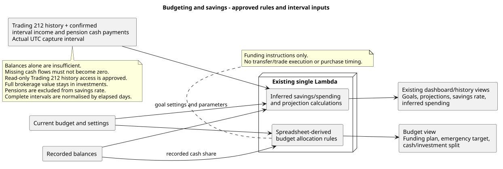

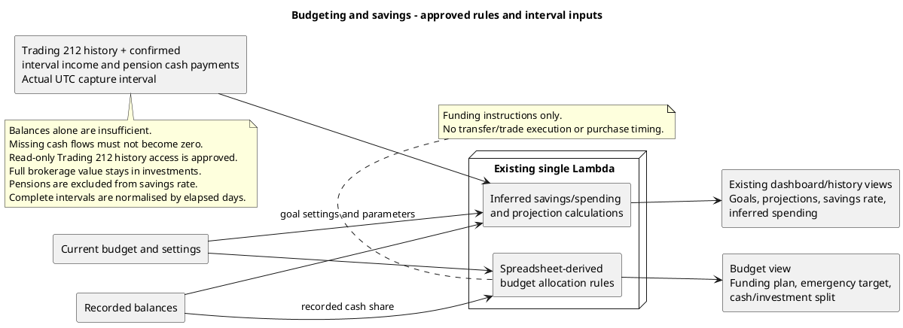

Acceptance requires comparison against spreadsheet examples for the dynamic rules, documented treatment of approved adaptations, and separate tests for market growth versus contributions, internal account transfers, missing inputs, negative cash, zero income, missing months, replaced months and incomplete current months. Do not claim full spreadsheet parity until those comparisons pass.

## Approved visual analytics and budget categories

The [chart design review](chart-design-review.md) defines the implemented chart set: stacked net-worth composition and total, asset mix, interval savings and savings rate, budget income allocation, category and expense breakdowns, destination funding, account working balances, provider holdings, component history and changes between snapshots. Preserve missing months as absent bars/data points, connect line series between recorded points across gaps, and preserve signed debts; use recorded values for historical charts and label working/provider values separately. Savings charts require complete actual capture intervals, with interval dates in tooltips.

Expenses and planned savings support optional user-defined category labels through a MUI freeSolo autocomplete. Trim labels and match existing names case-insensitively, with blank entries treated as Uncategorised. Persist them through budget autosave and allow grouping by category. No hardcoded categories or category-management page are needed.

Yearly and recent/previous three-interval savings-rate summaries use total eligible savings divided by total eligible income, rather than averaging percentages. Positive-income complete intervals with an available rate are eligible; otherwise show no rate. Year-to-date saved money still sums all complete intervals. Existing pension exclusions and actual-interval inference rules remain in force.

## Historical savings enrichment

Approved historical imports may use first-of-month London reading dates, declared Trading 212 account coverage, consistent aggregate cash coverage and a user-provided monthly income assumption. Missing snapshot months expand the interval income by the calendar-month gap. Pension contributions deducted before take-home pay require no cash-pension input. The first reading is a baseline. Store the reading date and assumption separately from live capture timestamps/valuations, retain previous revisions, and allow interval income corrections. Net-worth totals remain unchanged. See [calculation rules](calculation-rules.md#enriched-historical-readings).
